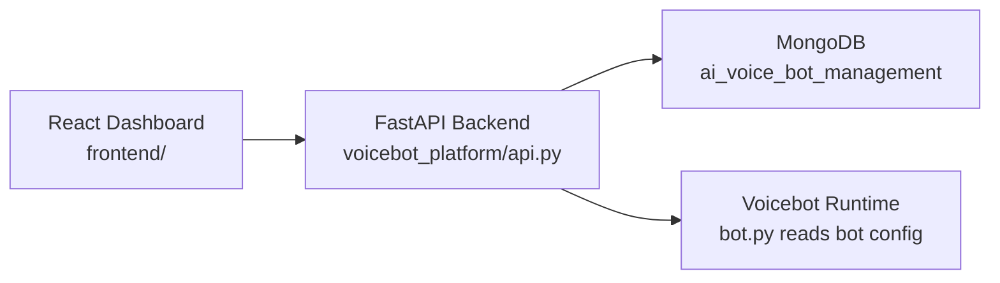
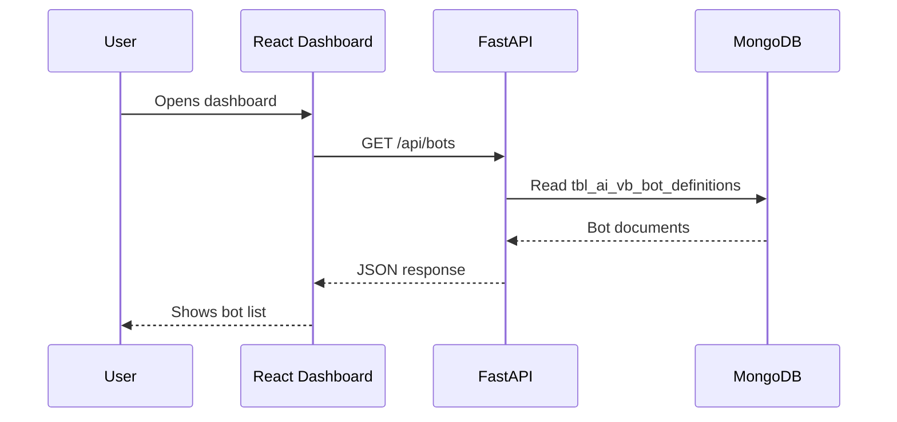
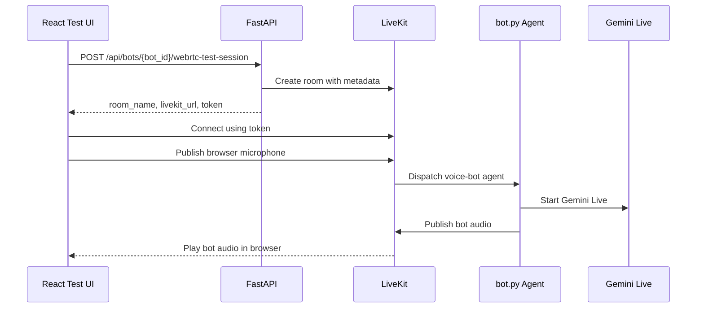

# Frontend + Backend FastAPI Handoff

This guide is for teammates who are new to FastAPI and need to connect the React dashboard to the Python backend in simple steps.

## What We Have

The app has two parts:



- React is the browser UI.
- FastAPI is the backend HTTP API.
- MongoDB stores bots, versions, campaigns and transcripts.
- `bot.py` is the voicebot worker that reads the published bot config from Mongo.

## Step 1: Start Mongo

Mongo server:

```txt
mongodb://192.168.13.65:27017
```

Database:

```txt
ai_voice_bot_management
```

Core collections:

```txt
tbl_ai_vb_bot_definitions
tbl_ai_vb_bot_versions
tbl_ai_vb_bot_templates
tbl_ai_vb_campaigns
tbl_ai_vb_call_transcripts
```

## Step 2: Seed First Bot

From project root:

```bash
cd /Users/justdial/voicebot_nodcode_platform
uv run python -m voicebot_platform.seed_default
```

Expected output:

```txt
Seeded default bot JustDial Lead Qualification assistant_id=e8c0fd31-2d60-4531-a029-2047b17988c4 version=1
```

This creates:

- One bot in `tbl_ai_vb_bot_definitions`
- One published version in `tbl_ai_vb_bot_versions`
- One template in `tbl_ai_vb_bot_templates`

## Step 3: Start FastAPI Backend

From project root:

```bash
./start_api.sh
```

It runs:

```bash
uv run uvicorn voicebot_platform.api:app --host 0.0.0.0 --port 8000
```

Open:

```txt
http://localhost:8000/health
```

Expected:

```json
{ "status": "ok" }
```

Open Swagger docs:

```txt
http://localhost:8000/docs
```

FastAPI automatically creates this page. Backend developers can test every API here without Postman.

## Step 4: Test API In Browser Or Curl

List bots:

```bash
curl http://localhost:8000/api/bots
```

List voices:

```bash
curl http://localhost:8000/api/options/voices
```

List languages:

```bash
curl http://localhost:8000/api/options/languages
```

## Step 5: Start React Frontend

In another terminal:

```bash
cd /Users/justdial/voicebot_nodcode_platform/frontend
npm install
npm run dev
```

Open:

```txt
http://localhost:5173
```

React talks to FastAPI through this Vite proxy in `frontend/vite.config.ts`:

```ts
server: {
  port: 5173,
  proxy: {
    '/api': 'http://localhost:8000',
    '/health': 'http://localhost:8000'
  }
}
```

This means frontend can call:

```ts
fetch('/api/bots')
```

instead of:

```ts
fetch('http://localhost:8000/api/bots')
```

## Request Flow



## Important API Calls

### List Bots

Frontend:

```ts
const bots = await fetch('/api/bots').then(res => res.json());
```

Backend route:

```txt
GET /api/bots
```

Response:

```json
[
  {
    "_id": "...",
    "assistant_id": "...",
    "name": "JustDial Lead Qualification",
    "description": "...",
    "owner": "system",
    "status": "active",
    "active_version_id": "...",
    "created_at": "...",
    "updated_at": "..."
  }
]
```

### Create Bot

Frontend:

```ts
await fetch('/api/bots', {
  method: 'POST',
  headers: {
    'Content-Type': 'application/json',
    'X-JD-User': 'tahir@justdial.com'
  },
  body: JSON.stringify({
    name: 'AC Lead Bot',
    description: 'Outbound AC qualification bot',
    config: {
      model: 'gemini-3.1-flash-live-preview',
      voice: 'Aoede',
      language: 'hindi',
      livekit_language: 'hi-IN',
      system_prompt: 'You are Simran...',
      temperature: 0.7,
      max_call_duration: 300
    }
  })
});
```

Backend route:

```txt
POST /api/bots
```

Creates:

- `tbl_ai_vb_bot_definitions`
- `tbl_ai_vb_bot_versions` version `1` as draft

### Save Draft

```txt
POST /api/bots/{bot_id}/draft
```

Payload:

```json
{
  "notes": "Changed prompt",
  "config": {
    "model": "gemini-3.1-flash-live-preview",
    "voice": "Kore",
    "language": "hindi",
    "livekit_language": "hi-IN",
    "system_prompt": "Updated prompt...",
    "temperature": 0.6,
    "max_call_duration": 300
  }
}
```

Creates a new draft version.

### Publish Draft

```txt
POST /api/bots/{bot_id}/publish
```

Payload:

```json
{
  "version_id": "draft-version-id"
}
```

This makes the selected version active for new calls.

Important rule:

```txt
Live calls keep old config.
New calls use the newly published config.
```

### Search Transcripts

```txt
GET /api/transcripts?bot_id=...&status=completed&text=budget
```

Supported filters:

```txt
bot_id
bot_version_id
campaign_id
lead_id
call_id
assistant_id
status
mobile
text
```

### Start WebRTC Test Call

Backend route:

```txt
POST /api/bots/{bot_id}/webrtc-test-session
```

Payload:

```json
{
  "campaign_id": "test",
  "lead_id": "lead-123",
  "call_id": "TEST-001",
  "mobile": "9999999999",
  "srchterm": "air conditioner",
  "buyer_name": "Test User",
  "city": "Mumbai"
}
```

Response:

```json
{
  "room_name": "test-e8c0fd31-a1b2c3d4e5",
  "livekit_url": "ws://your-livekit-server:7880",
  "token": "browser-livekit-jwt",
  "metadata": {
    "assistant_id": "e8c0fd31-2d60-4531-a029-2047b17988c4",
    "campaign_id": "test",
    "lead_id": "lead-123",
    "call_id": "TEST-001",
    "mobile": "9999999999",
    "srchterm": "air conditioner",
    "buyer_name": "Test User",
    "city": "Mumbai",
    "test_session": true,
    "room_name": "test-e8c0fd31-a1b2c3d4e5"
  },
  "agent_name": "voice-bot-justdial",
  "expires_in_sec": 1800
}
```

Required backend `.env` values:

```bash
LIVEKIT_URL=ws://your-livekit-server:7880
LIVEKIT_API_KEY=...
LIVEKIT_API_SECRET=...
LIVEKIT_AGENT_NAME=voice-bot-justdial
```

Frontend behavior:

1. Calls `/api/bots/{bot_id}/webrtc-test-session`.
2. Connects browser to `livekit_url` using `token`.
3. Requests microphone permission.
4. Publishes microphone audio.
5. Plays bot audio when the agent joins the room.



## File Responsibilities

```txt
voicebot_platform/api.py
```

Defines HTTP routes like `/api/bots`.

```txt
voicebot_platform/config_store.py
```

Reads/writes Mongo collections.

```txt
voicebot_platform/mongo.py
```

Creates Mongo client and indexes.

```txt
frontend/src/api.ts
```

Frontend helper functions that call backend APIs.

```txt
frontend/src/main.tsx
```

Current dashboard UI.

## Backend Developer Next Steps

1. Add Pydantic request/response models.
2. Add SSO role enforcement from headers.
3. Add stricter validation for bot config fields.
4. Add callback mapping APIs.
5. Harden WebRTC test-call error handling and room cleanup.

## Frontend Developer Next Steps

1. Replace JSON editor with real form sections.
2. Add bot create wizard using templates.
3. Add transcript detail page.
4. Add campaign create/edit page.
5. Add role-based UI once backend exposes roles.

## Common Problems

### Browser says localhost refused connection

FastAPI is not running.

Run:

```bash
./start_api.sh
```

### React page loads but APIs fail

Check backend:

```txt
http://localhost:8000/health
```

Check Vite proxy:

```txt
frontend/vite.config.ts
```

### No bots show up

Seed the default bot:

```bash
uv run python -m voicebot_platform.seed_default
```

### Mongo is empty

Confirm DB name:

```txt
ai_voice_bot_management
```

Confirm collections start with:

```txt
tbl_ai_vb_
```

## Simple Mental Model

```txt
React asks FastAPI.
FastAPI reads/writes Mongo.
bot.py reads published config from Mongo.
Calls write transcripts back to Mongo.
```
