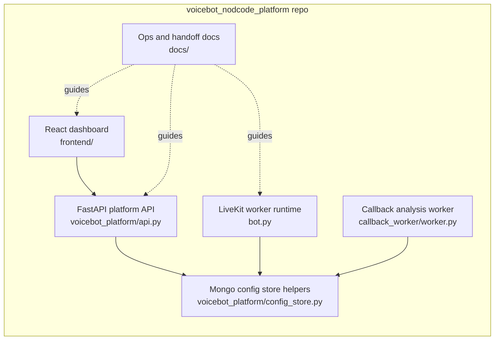
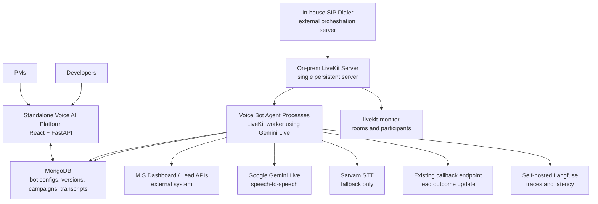
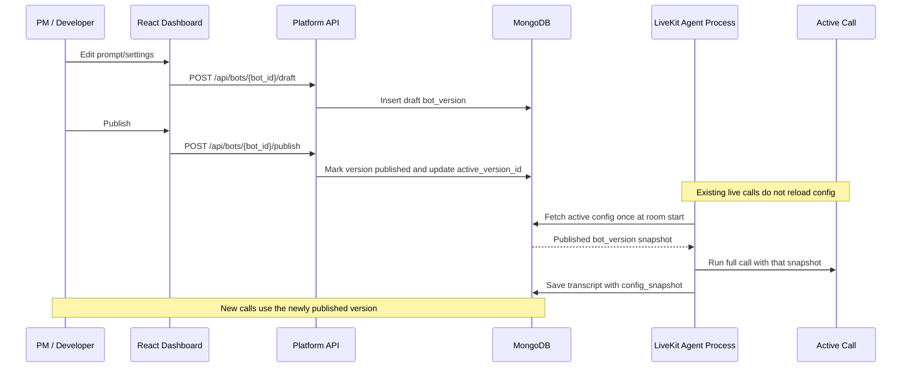
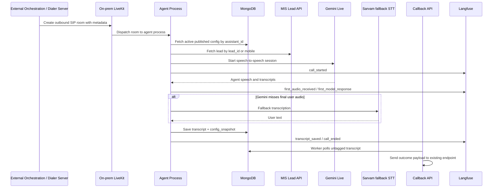
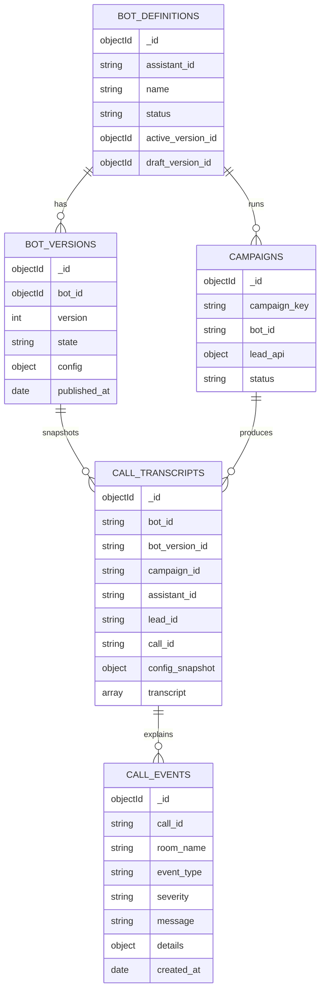
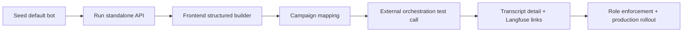

# Standalone Voice AI Platform Diagrams

This document is for frontend, backend, infra and operations experts joining the project. The no-code platform is a standalone app. The MIS dashboard and the current product orchestration server are external systems that this platform integrates with.

## Current Codebase Map



What has already been implemented:

- `voicebot_platform/api.py`: standalone platform API for bots, versions, campaigns, transcripts, options and templates.
- `voicebot_platform/config_store.py`: Mongo-backed bot definitions, immutable versions, active config lookup, campaign records and transcript search.
- `bot.py`: fetches active published config by `assistant_id`, uses dynamic model/voice/language settings and saves `config_snapshot` per call.
- `callback_worker/worker.py`: emits callback success/failure observability events.
- `frontend/`: React dashboard scaffold with bot list, builder, campaigns, test call, transcripts and observability screens.
- `ops/docker-compose.observability.yml`: starting point for `livekit-monitor` and self-hosted Langfuse.

## System Context



Key boundary:

- The standalone platform owns bot configuration, versioning, campaign mapping, transcript browsing and observability views.
- The MIS dashboard remains separate and continues to provide lead/customer/product/question data through APIs.
- The current orchestration/dialer server remains separate and is responsible for starting outbound calls and passing LiveKit room metadata.

## Publish And Config Snapshot Flow



This enforces the core safety rule: if a PM publishes while 50 calls are live, those 50 calls finish with their original prompt and settings.

## Outbound Call Data Flow



Room metadata expected from external orchestration:

```json
{
  "assistant_id": "published bot assistant id",
  "campaign_id": "outbound campaign id",
  "lead_id": "lead id from MIS",
  "call_id": "orchestration call id",
  "mobile": "customer mobile",
  "srchterm": "fallback product/search term",
  "buyer_name": "fallback buyer name",
  "city": "fallback city"
}
```

## Mongo Collections



Important implementation note:

- `bot_versions.config` is the editable/publishable runtime config.
- `tbl_ai_vb_call_transcripts.config_snapshot` is immutable evidence of what the bot used during that call.
- `tbl_ai_vb_call_events` stores the technical call timeline for debugging Gemini, Sarvam, LiveKit, transcript-save, and callback issues.

## Frontend Handoff

Frontend assistance is needed in these areas:

- Replace the current JSON config editor with structured controls for prompt, initial message, closing text, voice, language, model, temperature, VAD, timeout, Sarvam fallback thresholds and tool/API settings.
- Add real transcript filters and a transcript detail page using `GET /api/transcripts` and `GET /api/transcripts/{transcript_id}`.
- Add campaign screens for mapping outbound campaigns to bot versions and existing lead APIs.
- Add a test-call screen that displays the generated LiveKit room metadata and, later, starts a controlled call through the external orchestration server.
- Integrate VoiceDesk SSO and role-aware UI once security provides role group names.
- Add Langfuse trace links and LiveKit room status once infra provides endpoints.

Frontend information needed:

- Design system or visual reference for internal tools.
- SSO integration method and headers/tokens expected by backend.
- Which fields PMs can edit and which are admin/developer-only.
- Exact list of voices and languages approved for business users.
- Whether this app should later be embedded in the master dashboard shell or remain permanently standalone.

## Backend Handoff

Backend assistance is needed in these areas:

- Harden the FastAPI API with Pydantic request/response models and role enforcement.
- Confirm and validate the existing MIS lead API shape for buyer name, mobile, product, city, qualification schema and call id.
- Add direct test-call dispatch only if this standalone platform should call the external orchestration server.
- Add campaign validation around lead API authentication, rate limits and retry behavior.
- Decide whether config changes need approval workflow before publish.
- Expand Langfuse traces with exact Gemini timing, function-call latency, callback latency and error classification.

Backend information needed:

- MongoDB production database and collection naming policy.
- Existing lead API URLs, auth method, request params, response examples and rate limits.
- Existing callback API contract and expected payload changes, if any.
- External orchestration endpoint for starting outbound calls, if the platform should trigger calls.
- LiveKit API URL/key handling and how room metadata is created today.
- SSO group names for PM, Developer, Admin and Viewer.

## Infra And Ops Handoff

Infra assistance is needed in these areas:

- Rotate the SIP credentials shared in chat before production rollout.
- Deploy the standalone platform API and React app on-prem.
- Deploy self-hosted Langfuse and provide `LANGFUSE_PUBLIC_KEY`, `LANGFUSE_SECRET_KEY`, `LANGFUSE_HOST`.
- Deploy `jossephus/livekit-monitor` and register its webhook with the on-prem LiveKit server.
- Confirm safe concurrency limits for multiple agent processes per bot on the single persistent LiveKit server.
- Define alerts for no greeting, high Time to First Word, Gemini failures, callback failures and LiveKit room failures.

## What To Build Next



Recommended order:

1. Backend developer confirms MIS and orchestration contracts.
2. Frontend developer replaces JSON editor with forms.
3. Infra deploys Langfuse and LiveKit monitor in staging.
4. Team runs a controlled outbound test campaign.
5. Add SSO/roles before broad PM access.
